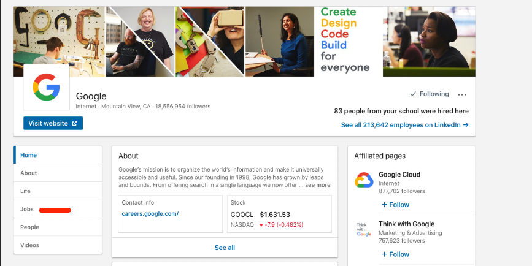

# linkedin-jobs-scraper
> Scrape public available job offers on Linkedin using headless browser (account credentials are not required).
> It is possible to run different queries on different locations concurrently. 
> For each job the following data fields are extracted: `title`, `company`, `place`, `date`, `link`, `applyLink`,
> `description`, `descriptionHTML`, `senorityLevel`, `jobFunction`, `employmentType`, `industries`.

## Table of Contents

<!-- toc -->

* [Installation](#installation)
* [Usage](#usage)
* [LinkedinScraper](#linkedinscraper)
* [Filters](#filters)
* [Company filter](#company-filter)
* [Logger](#logger)
* [License](#license)

<!-- toc stop -->


## Installation
Install package:
```shell
npm install --save linkedin-jobs-scraper
```


## Usage 
```js
const { 
    LinkedinScraper,
    ERelevanceFilterOptions,
    ETimeFilterOptions,
    EJobTypeFilterOptions,
    EExperienceLevelOptions,
    events,
} = require("linkedin-jobs-scraper");

(async () => {
    // Each scraper instance is associated with one browser.
    // Concurrent queries will run on different pages within the same browser instance.
    const scraper = new LinkedinScraper({
        headless: true,
        slowMo: 10,
    });

    // Add listeners for scraper events
    scraper.on(events.scraper.data, (data) => {
        console.log(
            data.description.length,
            data.descriptionHTML.length,
            `Query='${data.query}'`,
            `Location='${data.location}'`,
            `Title='${data.title}'`,
            `Company='${data.company}'`,
            `Place='${data.place}'`,
            `Date='${data.date}'`,
            `Link='${data.link}'`,
            `applyLink='${data.applyLink ? data.applyLink : "N/A"}'`,
            `senorityLevel='${data.senorityLevel}'`,
            `function='${data.jobFunction}'`,
            `employmentType='${data.employmentType}'`,
            `industries='${data.industries}'`,
        );
    });

    scraper.on(events.scraper.error, (err) => {
        console.error(err);
    });
    scraper.on(events.scraper.end, () => {
        console.log('All done!');
    });

    // Add listeners for puppeteer browser events
    scraper.on(events.puppeteer.browser.targetcreated, () => {
    });
    scraper.on(events.puppeteer.browser.targetchanged, () => {
    });
    scraper.on(events.puppeteer.browser.targetdestroyed, () => {
    });
    scraper.on(events.puppeteer.browser.disconnected, () => {
    });

    // Custom function executed on browser side to extract job description
    const descriptionFn = () => document.querySelector(".description__text")
        .innerText
        .replace(/[\s\n\r]+/g, " ")
        .trim();

    // Run queries concurrently    
    await Promise.all([        
        scraper.run({
            query: "Graphic Designer",
            options: {
                locations: ["London"],
                descriptionFn: descriptionFn,
                filters: {                    
                    relevance: ERelevanceFilterOptions.RELEVANT,
                    time: ETimeFilterOptions.MONTH,                    
                }
            }
        }),
    
        // Run queries serially
        scraper.run([
            {
                query: "Engineer",
                locations: ["Germany"], // This will override global option locations ([New York])                
            },
            {
                query: "Sales",
                options: {                    
                    limit: 10, // This will override global option limit (33)
                }
            },
        ], { // Global options for this run, will be merged individually with each query options (if any)
            locations: ["New York"],
            optimize: true,
            limit: 33,
        }),
    ]);

    // Close browser
    await scraper.close();
})();
```


## LinkedinScraper
Each `LinkedinScraper` instance is associated with one browser (Chromium) instance. Concurrent runs will be executed
 on different pages within the same browser. Package uses [puppeteer](https://github.com/puppeteer/puppeteer) under the hood
 to instantiate Chromium browser instances; the same browser options and events are supported.
 For more informations about browser options see: [puppeteer-browser-options](https://pptr.dev/#?product=Puppeteer&version=v2.0.0&show=api-puppeteerlaunchoptions).
 For more information about browser events see: [puppeteer-browser-events](https://pptr.dev/#?product=Puppeteer&version=v2.0.0&show=api-class-browser).
 The main method is `run` which takes the following parameters:
 
* `queries` {IQuery | IQuery[]} required.
* [`options`] {IQueryOptions} optional: 
    - [`limit`] {Number} Number of jobs to retrieve per `query-location`.
    - [`descriptionFn`] {Function} Function executed on browser side (you have access to `window`, `document`, etc) to extract job description.
    - [`filters`] {Object} Filter options (see section [Filters](#filters) for more details). 
    - [`optimize`] {Boolean} Block resources such as images, stylesheets etc to improve bandwidth usage. Specifically the following resources are blocked:
        * image
        * stylesheet
        * media
        * font
        * texttrack
        * object
        * beacon
        * csp_report
        * imageset
 
```ts
/**
 * Main class
 * @extends EventEmitter
 * @param options {LaunchOptions} Puppeteer launch options, for more informations see https://pptr.dev/#?product=Puppeteer&version=v2.0.0&show=api-puppeteerlaunchoptions
 * @constructor
 */
constructor(options: LaunchOptions) { }

/**
 * Scrape linkedin jobs
 * @param {IQuery | IQuery[]} queries
 * @param {IQueryOptions} [options]
 * @return {Promise<void>}
 */
async run (
    queries: IQuery | IQuery[],
    options?: IQueryOptions
) { }

/**
* Close browser instance
* @returns {Promise<void>}
*/
async close() { }

/**
 * Enable logger
 * @returns void
 * @static
 */
enableLogger() { }

/**
 * Disable logger
 * @returns void
 * @static
 */
disableLogger() { }

/**
 * Enable logger info namespace
 * @returns void
 * @static
 */
enableLoggerInfo() { }

/**
 * Enable logger error namespace
 * @returns void
 * @static
 */
enableLoggerError() { } 
```

## Filters
It is possible to customize queries with the following filters:
- RELEVANCE:
    * `RELEVANT`
    * `RECENT`
- TIME:
    * `DAY`
    * `WEEK`
    * `MONTH`
    * `ANY`
- JOB TYPE:
    * `FULL_TIME`
    * `PART_TIME`
    * `TEMPORARY`
    * `CONTRACT`
- EXPERIENCE LEVEL:
    * `INTERNSHIP`
    * `ENTRY_LEVEL`
    * `ASSOCIATE`
    * `MID_SENIOR`
    * `DIRECTOR`
    
See the following example for more details:

```js
const { 
    LinkedinScraper,
    ERelevanceFilterOptions,
    ETimeFilterOptions,
    EJobTypeFilterOptions,
    EExperienceLevelOptions,
    events,
} = require("linkedin-jobs-scraper");

(async () => {
    // [...]
    
    await scraper.run({
            query: "",
            options: {
                filters: {                    
                    relevance: ERelevanceFilterOptions.RELEVANT,
                    time: ETimeFilterOptions.MONTH,
                    type: EJobTypeFilterOptions.FULL_TIME,
                    experience: EExperienceLevelOptions.MID_SENIOR,
                }
            }
        }, {
            optimize: true,
            locations: ["United States"],
            limit: 10,
        });

    // [...]
})();
```

### Company Filter

It is also possible to filter by company using the public company jobs url on LinkedIn. To find this url you have to:
 1. Login to LinkedIn using an account of your choice.
 2. Go to the LinkedIn page of the company you are interested in (e.g. [https://www.linkedin.com/company/google](https://www.linkedin.com/company/google)).
 3. Click on `jobs` from the left menu.
 
 4. Scroll down and locate `See all jobs` or `See jobs` button.
 
 5. Right click and copy link address (or navigate the link and copy it from the address bar).
 6. Paste the link address in code as follows:
 
```js
// [...]

await scraper.run({
    query: "",
    options: {
        filters: {        
            // Copy link address here    
            companyJobsUrl: "https://www.linkedin.com/jobs/search/?f_C=1441%2C17876832%2C791962%2C2374003%2C18950635%2C16140%2C10440912&geoId=92000000&lipi=urn%3Ali%3Apage%3Acompanies_company_jobs_jobs%3BcbFm1gYoRwy%2FxVRQWbGyKw%3D%3D&licu=urn%3Ali%3Acontrol%3Ad_flagship3_company-see_all_jobs",            
        }
    }
});

// [...]
```
  
## Logger
Logger uses [debug](https://github.com/visionmedia/debug) package under the hood. The following namespace are used:
* `scraper:info`
* `scraper:error`

Use environment variable `DEBUG` or the programmatic API to selectively enable/disable one or more namespace.

## License
[MIT License](http://en.wikipedia.org/wiki/MIT_License)
